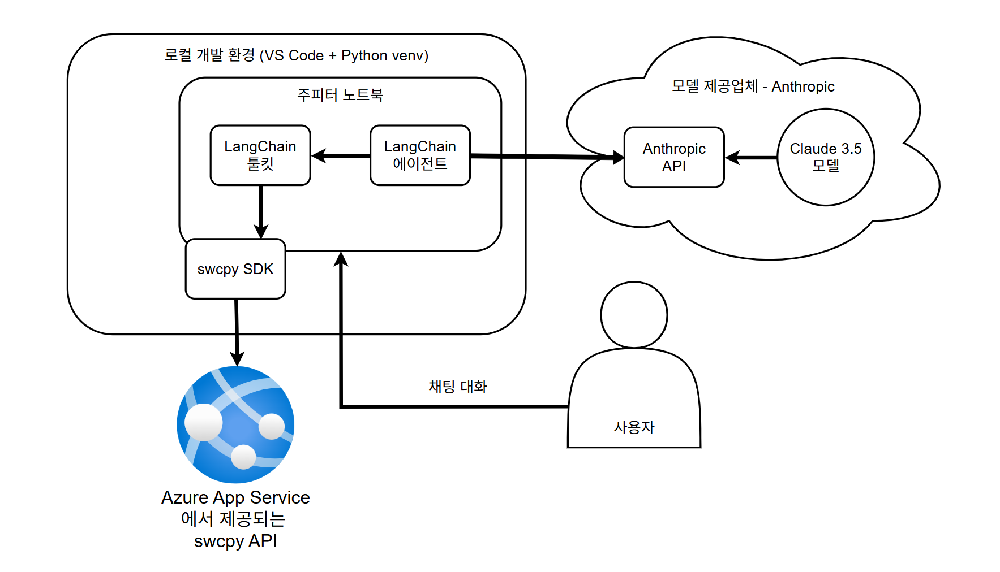

# LangChain을 활용해 API 사용하기

**LLM이 시스템의 동작 방식을 더 많이 결정할수록, 그 시스템은 더욱 '에이전트형'이 된다.**
> 해리스 체이스(Harrison Chase), LangChain 창시자

---

AI 애플리케이션은 LLM을 사용자와 자연어로 소통하는 인터페이스로 활용한다. 최근에는 LLM을 이용해 다단계 작업을 자동으로 수행하는 방법이 활발히 연구되고 있다. 
이번 프로젝트에서는 API와 LLM을 결합해 AI 애플리케이션을 만드는 두 가지 두요 방법을 살펴본다.

첫 번째는 API를 이용해 LLM을 호출하는 방법이고, 두 번째는 LLM을 통해 외부 API를 호출하는 방법이다. 두 방법 모두 **LangChain**을 활용해 실습한다.

LangChain과 이와 관련된 프로젝트인 LangGraph는 오픈 소스 프레임워크로, LLM이 시스템의 동작을 제어하는 에이전트형 애플리케이션을 만들 수 있도록 지원한다. 기존에는 개발자가 LLM API를 직접 호출하며 사용자 정의 코드를 작성해 애플리케이션을 개발해야 했지만, LangCHain과 LangGraph는 이런 개발 과정에서 필요한 여러 작업을 표준화한다. 쉽게 말해, 이들은 API나 모델 위에 올라가는 상위 프레임워크라 할 수 있다.

이번 프로젝트에서 주로 사용될 용어는 다음과 같다.

1. 에이전트
- 해리슨 체이스는 에이전트를 'LLM을 사용해 애플리케이션의 제어 흐름을 결정하는 시스템'이라고 정의했다. 에이전트는 기존 소프트웨어처럼 미리 프로그래밍되는 것이 아니라, 모델의 추론을 바탕으로 대화 흐름과 실행 경로를 스스로 결정한다. 함수 호출이 가능한 모델이 제안하는 도구 호출을 실제로 실행할 수 있다.

2. 함수 호출 모델 (Function-Calling Model)
- 함수 호출 모델은 사용 가능한 함수 또는 도구를 언제 사용할지 제안하는 특수한 모델이다. 이름과 달리 모델이 직접 함수를 호출하지 않고, 사용할 함수를 에이전트에 제안하는 역할을 한다.

3. 모델
- LangChain 사용자가 호출하는 AI 모델이다. 로컬에 다운로드해서 쓰거나 모델 제공 업체의 웹 API를 통해 호출할 수 있다.

4. 모델 패밀리
- 같은 이름과 아키텍처를 공유하는 여러 모델을 의미한다.

5. 툴킷
- 에이전트가 작업을 수행하는 데 사용하는 여러 도구 모음이다.

6. 도구 또는 함수
- 에이전트에게 추가 기능을 제공하는 코드 블록이다. 예를 들어, 파이썬 함수로 수학 연산을 할 수도 있다.

이번 프로젝트에서 사용하는 도구는 다음과 같다.

|소프트웨어 이름|버전|목적|
|---|---|---|
|LangChain|0.3|에이전트가 API를 사용할 수 있도록 도구와 툴킷을 만드는 파이썬 라이브러리|
|LangGraph|0.2|에이전트 애플리케이션을 구성할 수 있게 하는 파이썬 라이브러리|
|Anthropic Claude|3.5 Sonnet|LangGraph 에이전트에 추론 기능을 제공하는 LLM 모델|
|Pydantic|2|툴킷에서 데이터 유효성 검사를 담당하는 파이썬 라이브러리|
|swcpy|0.2.0|이전 프로젝트에서 만든 SWC API용 SDK|

이번 프로젝트에서 구출할 프로젝트의 상위 수준 아키텍처는 아래와 같다.

LangChain이 어떤 API와 상호 작용하는지 이해하려면 LangChain이 지원하는 다양한 모델 API를 살펴보는 것이 도움이 된다. 
[LangChain의 Chat Models 페이지](https://python.langchain.com/docs/integrations/chat/)에는 60개 이상의 챗 모델 제공업체가 나와있으며, 이 중 일부는 함수 호출 기능을 지원한다. 이 기능은 도구를 사용해 외부 API를 호출할 수 있기 때문에 이번 프로젝트에서 중요하게 다룬다.

이 모델 제공업체의 문서를 살펴보면, 일반적으로 API에 대한 문서를 제공하고 API 키 등록(유료)을 허용한다. 여기에는 API 키 발급, 다양한 언어의 SDK, 인터랙티브 문서, 지원 서비스 등이 있음을 알 수 있다. 이들에게 API 사업은 부가적인 것이 아닌 핵심 사업 그 자체이다.

---

## Anthropic 가입하기

Anthropic 모델을 사용할 것이므로 [클로드로 구축하기 웹페이지](https://console.anthropic.com/login)에서 Anthropic 계정을 만들어야 한다.
Anthropic API를 사용하려면 초기 계정을 **Build Plan**으로 업그레이드하고 계정에 결제 수단을 추가해야 한다.
> 과도한 비용 청구를 막기 위해 처음에는 5달러 정도만 충전하고 자동 춘전 기능을 비활성화하는 것이 좋다. 이렇게 하면 API키가 잘못 사용되더라도 최대 5달러까지만 비용이 청구된다.

